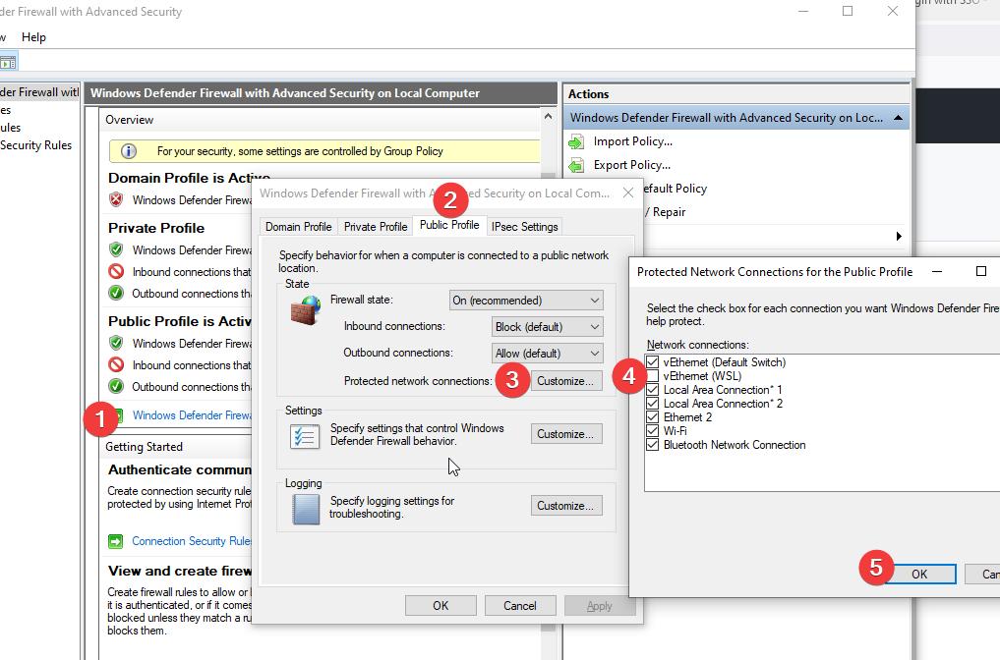
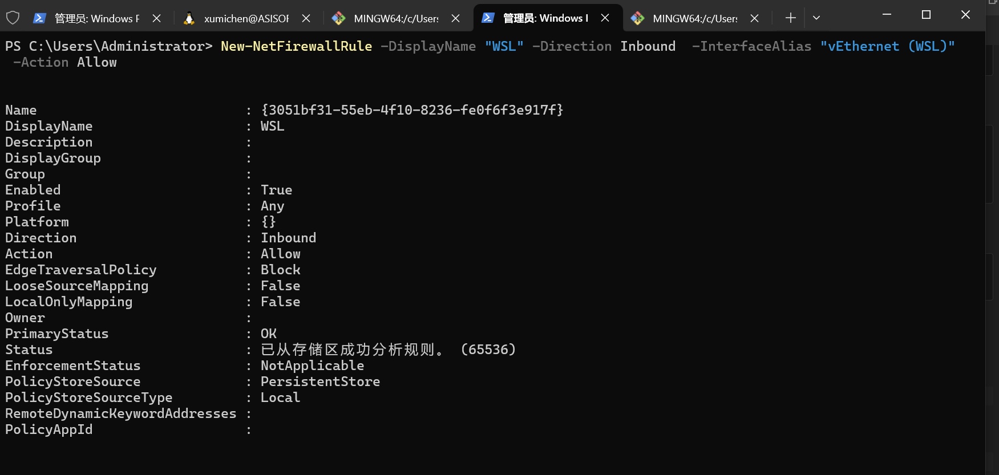

> windows防火墙默认允许出站连接(windows -> wsl)，如何只需要配置入站连接(wsl -> windows)，如下图

### 通过页面配置WSL2访问Windows防火墙规则
如下图 


### 命令行配置WSL2访问WindowsWSL2访问Windows

#### 新建防火墙规则

```powershell
New-NetFirewallRule -DisplayName "WSL" -Direction Inbound -InterfaceAlias "vEthernet (WSL)" -Action Allow
```



#### 查看创建的wsl防火墙规则

```powershell
Get-NetFirewallRule -Direction Inbound | Where-Object { $_.DisplayName -like "*WSL*" }
```

#### 删除wsl防火墙规则

```powershell
Remove-NetFirewallRule -DisplayName "WSL"
```
### 参考
WSL2 连接 Windows 防火墙问题解决方案
> https://zhuanlan.zhihu.com/p/365058237

配置局域网的其他主机上中访问本机的WSL2
> https://zhuanlan.zhihu.com/p/425312804
