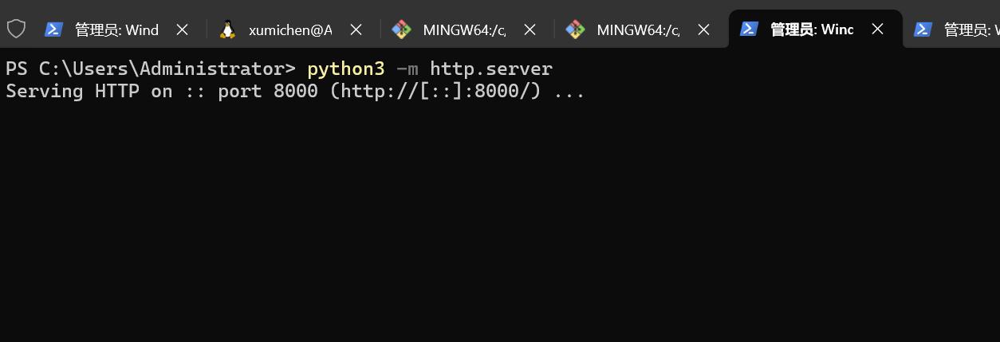
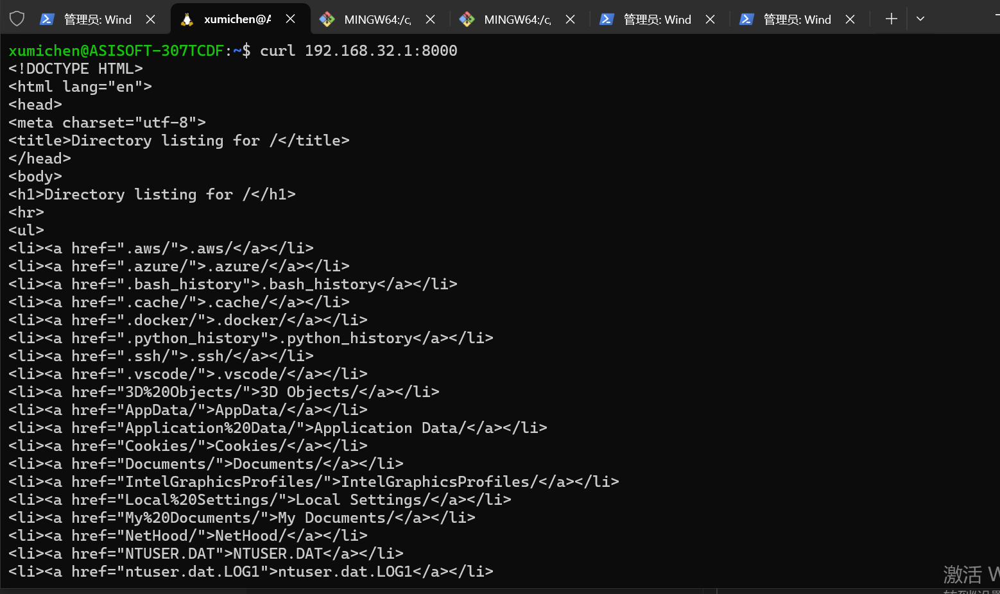
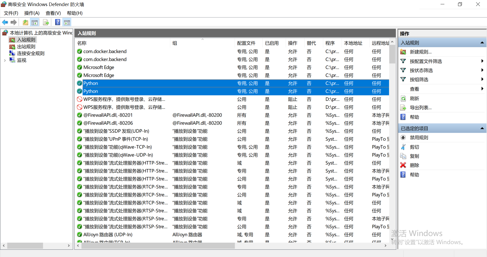
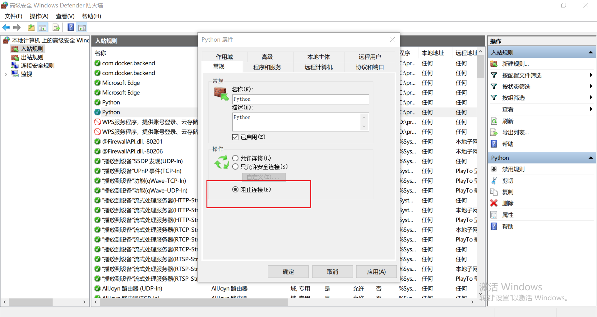
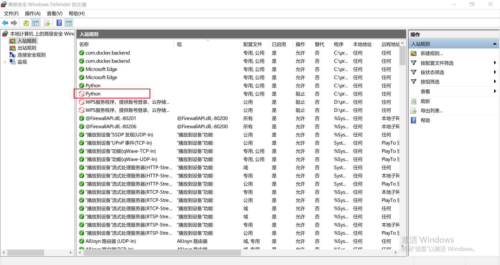
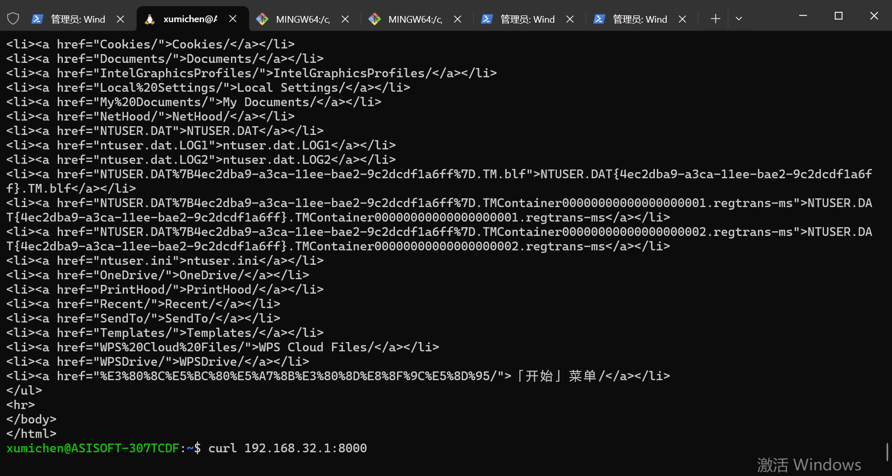

## win下启动一个 python server

## 发现wsl可以访问

## 原因是python启动服务的时候会弹出防火墙规则，选择确认之后会创建两个规则，tcp和udp

## 验证: 把tcp规则关闭

## 此时不能访问

## ping不通的原因
> ping命令不属于python的防火墙规则，windows默认的规则是不允许被ping

### 参考
> Ping命令的工作过程及单向Ping通的原因
https://www.cnblogs.com/yxmx/articles/1547375.html
